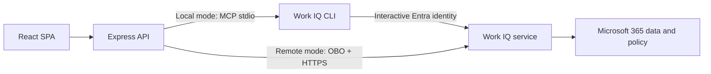

# Work IQ Demo Console

A React and Express reference application for querying Work IQ MCP as a signed-in Microsoft Entra user. It supports synthetic demo data, local interactive authentication through the official Work IQ CLI, and production delegated on-behalf-of (OBO) authentication.

For the no-app-registration local setup, see [FIRST_TEST_README.md](FIRST_TEST_README.md).

## Architecture



Local mode is for one trusted user on one workstation. Remote mode keeps the Work IQ token in the backend and supports authenticated web users.

## Application experiences

- **Work IQ Console** asks grounded questions across the signed-in user's Microsoft 365 context.
- **HR Connect** builds an evidence-based performance reflection covering delivered results, goals, security, quality, AI, behaviors, setbacks and growth, teamwork, partners, and a configurable primary customer such as Bimbo. Claims without sufficient Microsoft 365 evidence are marked for follow-up instead of being invented.
- **Logistics Intelligence** provides a Work IQ-powered control tower brief answering what happened, why it happened, who is working on it, what was already decided, and what should happen next. It distinguishes verified facts from hypotheses and evidence gaps. Disable its **Live Work IQ scenario** checkbox to populate a fictional cold-chain incident and preview a complete synthetic response without querying Microsoft 365.
- **Business Value** demonstrates Decision Intelligence, Organizational Memory, Expert Discovery, and Agent Action. Every card includes an editable example question and runs a real Work IQ query; independent grounded responses appear below the maturity progression while untouched scenarios retain response guides.

## Stack

- React 19, TypeScript, Vite, Tailwind CSS 4
- Fluent UI React v9, React Query, MSAL Browser/React
- Node.js 20+, Express 5, TypeScript, MSAL Node
- Model Context Protocol TypeScript client v2
- Vitest and Supertest

## Run locally with your Entra account

Prerequisites: Node.js 20 or newer, npm, tenant admin consent for the Microsoft Work IQ application, and assignment to a Copilot Credits billing policy.

```powershell
npm install
npm run workiq:accept-eula
npm run workiq:login
npm run workiq:test
npm run dev
```

Set `WORK_IQ_MODE=local` and `WORK_IQ_LOCAL_ACCOUNT=<your-email>` in `.env`, then open `http://localhost:5173`. No frontend `.env`, custom app registration, client secret, or OBO credential is required in local mode.

## Configure live Work IQ

### 1. Register the Express API

1. Create a Microsoft Entra app registration for the Express API.
2. Under **Expose an API**, set the Application ID URI to `api://<api-client-id>`.
3. Add the delegated scope `access_as_user`.
4. Add the delegated Work IQ permission `WorkIQAgent.Ask` to this app and grant tenant admin consent.
5. For local development, create a client secret. For production, use a certificate credential.

Work IQ delegated scope:

```text
api://workiq.svc.cloud.microsoft/WorkIQAgent.Ask
```

Work IQ service principal application ID:

```text
fdcc1f02-fc51-4226-8753-f668596af7f7
```

### 2. Register the SPA

1. Create a second app registration with a **Single-page application** redirect URI of `http://localhost:5173`.
2. Add the Express API delegated permission `api://<api-client-id>/access_as_user`.
3. Add the SPA client ID as an authorized client application on the API registration where appropriate for your tenant policy.

### 3. Configure environment files

```powershell
Copy-Item .env.example .env
Copy-Item frontend/.env.example frontend/.env
```

Set `WORK_IQ_MODE=remote`, fill the API and SPA client IDs, select allowed tenant IDs, and provide one backend confidential-client credential. Never place the backend credential in a `VITE_` variable.

For multitenant deployments, validate the user's home tenant, keep `ALLOWED_TENANT_IDS` restrictive where possible, and complete publisher verification and admin consent before rollout.

## Commands

| Command | Purpose |
| --- | --- |
| `npm run dev` | Run the API and Vite development server |
| `npm run workiq:accept-eula` | Accept the Work IQ CLI EULA interactively |
| `npm run workiq:login` | Sign in with the local Entra account |
| `npm run workiq:test` | Verify Work IQ directly before starting the app |
| `npm run workiq:config` | Show the persisted Work IQ CLI configuration |
| `npm run typecheck` | Type-check both workspaces |
| `npm test` | Run backend API contract tests |
| `npm run build` | Build both production bundles |
| `npm start` | Start the compiled backend |

The production frontend bundle is written to `frontend/dist`. Serve it from a static host and route `/api` to the backend, or place both behind the same reverse proxy.

## Security and operations

- The API validates token signature, issuer, audience, tenant ID, and algorithm.
- Local mode is single-user and must only bind to a trusted workstation; it uses the identity cached by the Work IQ CLI.
- Work IQ supports delegated user access only; application-only access is not used.
- Use certificate credentials or managed workload identity patterns for production deployments.
- Do not log access tokens, prompts, or Work IQ results without an approved data-handling policy.
- Work IQ does not automatically retry. Keep retries bounded and honor `Retry-After` for throttled requests.
- Mutation tools are not exposed by this application. Tenant policy blocks mutations by default in Work IQ MCP.
- Enforce usage limits through Microsoft 365 Copilot spending policies. There is currently no documented public runtime API for a user's Copilot Credits balance, so the UI states that limitation instead of fabricating a value.

## Official references

- [Work IQ MCP overview](https://learn.microsoft.com/en-us/microsoft-365/copilot/extensibility/work-iq/mcp/overview)
- [Work IQ MCP tool reference](https://learn.microsoft.com/en-us/microsoft-365/copilot/extensibility/work-iq/mcp/tool-reference)
- [Work IQ permissions](https://learn.microsoft.com/en-us/microsoft-365/copilot/extensibility/work-iq/permissions)
- [Microsoft Entra OBO flow](https://learn.microsoft.com/en-us/entra/identity-platform/v2-oauth2-on-behalf-of-flow)
- [Copilot Credits billing](https://learn.microsoft.com/en-us/microsoft-365/copilot/usage-based-billing-overview-copilot-credits)